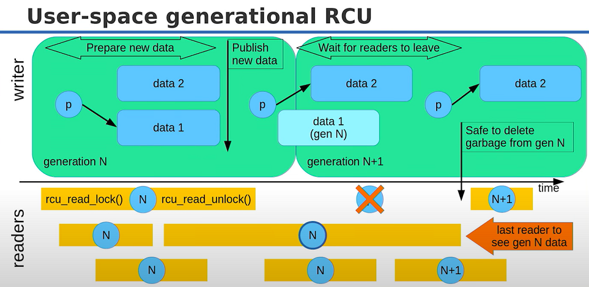

# Concurrency

# 1. Atomics & Lock-free Programming

# 2. RCU: Read, Copy, Update

## 2.1. read-only data, infrequent writes
input data data doesn't change -> can have multiple concurrent readers and one writer, or locked writing if it's infrequent. scales pretty well.

## 2.2. almost read-only data, infrequent writes
input data changes but rarely. Again many reader threads and one writer thread or one writer thread at a time. ideally reader performance should not be affected (but it does).
the data might change as a reader is reading it. without any synchronization, this is a data race.

1. we don't want the readers wait on each other
2. we (ideally) don't want the readers to wait for the writer
3. we can't have the readers block the writer indefinitely
4. we (ideally) don't want the writer to wait at all

## 2.3.1 possible solutions
lock-free programming, e.g. a lock free list, is generic and scales well for bigger problems with multiple writers but has an overhead that is not worth paying in this case.

### pthread_rwlock_t
still one order of magnitude slower than the read-only case even if there are no writes.

### atomic read/writes
with a single writer, we can do something naive like:
```cpp
std::atomic<node*> head;
// reader:
node* p = head;
do_search(p);
// writer:
node* new_node = new node(...);
new_node->next = head->next;
head = new_node;
```
some reads will get the old version of `head`. to make correct use of atomics, we should do:
```cpp
std::atomic<node*> head;
// reader
node* p = head.load(std::memory_order_acquire);
do_search(p);
// writer
node* new_node = new node(...);
node* next = head.load(std::memory_order_relaxed)->next; // [R]ead current data (next_ptr)
new_node->next = next;                                   // [C]opy it to new data
head.store(new_node, std::memory_order_release);         // [U]pdate current data
```
- we need an `acuire` barier on the load to make sure all previous writes become visible to te reader.
- for each `acuire`, there is a coupled release on the writer side.

on the writer we have 3 sepearate actions. this is sometimes called copy-on-write (java) or publishing protocol. it constitutes a small part of RCU.

## 2.2. root pointer
the publishing protocol access the data through the "root pointer". this could be e.g. an index into an array and must be atomic.
- reader: acquire root pointer atomically, access data
- writer: read current data, copy to new data, update data and publish it

some readers will see the old data which is to be expected in concurrent programs

### 2.2.1. example: thread-safe growable array
- resizing can be locked or limited to one thread
- array elements that existed before resize remain where they are and can be accessed by any thread, lock-free
- resize does not invalidate pointers

generally, move-less growable arrays are implemented using block-allocated containers.


- the reference block has pointers to the data blocks.
- the container has a pointer to the reference block and has a size.
- resize adds one or more blocks
- old blocks never move
- operator[] needs one extra indirection, `C[i]`
    - read data block pointer from reference block `p[i%N]`
    - access array element in the data block `bx[i/N]`
    - use bit arithmetic in practice instead of /, %

workflow:
1. writer publishes new blocks, then updates size (release).
2. reader acquires size, guaranteed to access `C[0]` - `C[size - 1]`.
    - size is the root pointer, not `p`
    - `operator[]` is not locked for readers

when the reference block is full, we allocate a larger block, copy the old pointers, add new data block pointer, RCU.

*problem*:<br>
we run into an issue when the writer is swapping reference blocks and the reader is trying to get the data ptr that it needs. we have to keep the reference block in the memory as long as there is at least one reader that can access it. for this particular deque, easiest solution is to just never delete old reference block if the data is sufficiently large.

## 2.3. RCU memory reclamation
RCU uses cooperative protocol to track when it is safe to reclaim memory, i.e. when no reader has access to it. readers must follow these steps to access shared data:
1. call `rcu_read_lock()` to request access
2. get the root pointer (not use the old copy)
3. call `rcu_read_unlock()` to announce end of access

outside of this "critical secion" (aka quiescent state), readers may not access the shared data.

writers must folow these steps to modify shared data:
1. make old shared data inacessible from the root
2. call synchronize_rcu() to wait for all readers who called `rcu_read_lock()` before step 1 to call `rcu_read_unlock()`
3. delete old data and reclaim memory

writers doesn't need to wait for all readers to exit critical section, only those who have a acquire the old root pointer.

### example


readers acquire lock on data 1 while the writer is preparing data 2. at some point, data 2 is published and data 1 is hidden away. one basic implementation is keeping reference counts to data 1 (p1) or the readers. that have acquired it. 

## 2.4. RCU in the kernel
RCU is used heavily in the linux kernel. kernel RCU has several advantages:
- kernel knows when context switches happen (when readers leave critical section)
- kernel knows how many threads are there, which ones are running, etc
- kernel RCU does not need (extra) memory barriers
    - there are already other barriers in place synchronization

## 2.5. RCU vs. GC
RCU does memory reclamation once an object is unreachable, just like garbage collection. strictly speaking, GC implies being "automatic". user-driven GC is a contradictory term. memory reclamation in RCU is a kind of user-driven GC.

## 2.6. user-space generational RCU
the writer maintains a global atomic called generation/epoch: `std::atomic<size_t> generation`. all data currently live belong to the current generation. when the writer does an update, the old data is put ina a garbage queue. there is one garbage queue per generation. at some point, the writer increments the generation. readers can only request access to current generation data, but can keep accessing it after it becomes garbage. writers keep track of how many readers access each generation.



note that publishing new data and increasing the generation are not necessarily tied together.<br>
when readers request a lock, they only get the value of the current data generation, instead of a pointer to the underlying data. during unlocking, they must provide this number to the container in order to trigger GC if necessary.

```cpp
std::atmoic<unsigned long> generation;
std::atmoic<unsigned long> refcount[max_generations];

class handle_t {...}; // contains reader generation
handle_t rcu_read_lock() {
    size_t cg = generation;
    ++refcount[cg];
    return handle_t(cg);
}
void rcu_read_unlock(handle_t handle)
{
    --refcount[handle.get()];
}

std::queue<data_t*> garbag[max_generations];
size_t last_gc_gen = 0;
void synchronize_rcu() {
    size_t last_gen = generation++;
    while (last_gc_gen < last_gen) {
        while (refcount[last_gc_gen] > 0) wait(); // can have a timeout
        delete_garbage(garbage[last_gc_gen]);
        ++last_gc_gen;
    }
}
```

atmoics are `memory_order_seq_cst` by default which is expensive. the real implementation will use `acquire`,`release` and `relaxed` as much as possible. one `seq_cst` is _usually_ unavoidable.

## 2.7. improvements
all RCU implementations will have the 3 lock,unlock,sync functions. reader implementations may try to minimize `read_lock()` and `read_unlock()` overhead:
- read generation number
- increment reference count: consits of read,modify,write of shared data
- read root pointer: needs an acquire memory barrier

cache contention on the reference count is the main overhead in user-space RCU.

### 2.7.1. faster readers
reference count is shared between all readers. we could give each reader its own count
```cpp
handle_t rcu_read_lock(size_t reader_id) {
    size_t cg = generation;
    ++refcount[reader_id][cg]; // padded to cache line
    return handle_t(cg);
}
```
reader ID can just be the thread ID (consecutively mapped). reader threads must register in advance with the RCU. writer must loop over all reader slots to add up the count.<br>

if nested critical sections are not required, each reader may only access one version of the shared data at a time -> no need for refcount array:
```cpp
void rcu_read_lock(size_t reader_id) {
    size_t cg = generation;
    reader_gen[reader_id] = cg; // padded to cache line
}

constexpr size_t NO_READER = 0;

void rcu_read_unlock(size_t reader_id) {
    reader_gen[reader_id] = NO_READER;
}
```

### 2.7.2. writers
synchronize_rcu vs. call_rcu: often a callback function is given to the RCU to delete the data when it is time to reclaim memory. the RCU writer may defer deletion callbacks and queue them:
```cpp
data_t* old_data = current_data;
data_t* new_data = new data_t(*old_data);
new_data->update();
current_data = new_data;
call_rcu(old_data, deletr); // deferred until readers leave
```

granularity of updates (how many data updates go into a generation) and granularity of cleanup (how often to reclaim memory) affect the performance of the writer.

### 2.7.3. weird readers
a reader might retain a reference to a generation forever and block reclamation. in this case, the writer will need a timeouut on the wait. writers can also force reclaim memory as long as the reader can handle it. e.g. it could be a reuse of already allocated memory, instead of giving it back to the OS. `read_unlock()` could inform the reader that its data was invalid, s.t. it can drop what it has done, reaquire lock and recompute. one could also do multiprocessing and let readers crash.

## 2.8. when to RCU
rare updates, inconsistent data ok = good<br>
frequent updates, perfect consistency required = bad<br>
alternatives: hazard pointers (hard to use), atomic shared pointers (good for frequent writing)